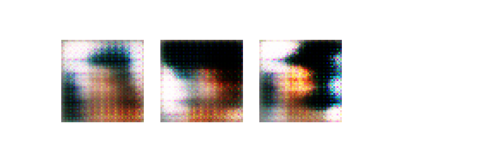
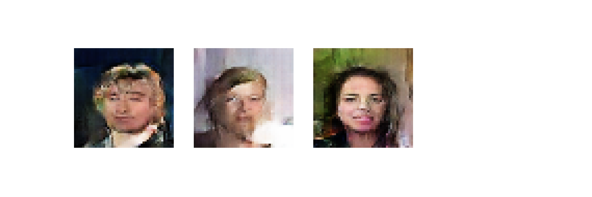

# gan-celeba
An attempt at GANs using the [Kaggle `celeb_a` dataset](https://www.kaggle.com/jessicali9530/celeba-dataset).

#### GIF of images generated through 1,000 epochs:

  
#### Output at 1st epoch:

#### Output at 1,000th epoch:

#### Synthesized images using trained generator (zoom!):

#### Training:
* Network architecture: slightly modified [DCGAN](https://arxiv.org/abs/1511.06434)
* Average training time per epoch: ~51.3 sec
* Batch size: 256
* Latent vector size: 200
* Image dimensions: 48 * 48 * 3
* Optimizers:
  * Generator: Adam (lr=1e-4, b1=0.9, b2=0.999, epsilon=1e-07)
  * Discriminator: Adam (lr=2e-4, b1=0.9, b2=0.999, epsilon=1e-07)

#### System config:
* CPU: Intel i7 6700K (4.4 GHz)
* RAM: 32 GB DDR4 (2.4 GHz)
* GPU: Nvidia GTX 1070 (1,920 CUDA cores @ 1.9 GHz, 8 GB GDDR5)
* TensorFlow 2.2.0
* cuDNN 7.6.5

#### Learnings:
Vanilla GANs suffer from the problem of instability. A basic [GAN](https://arxiv.org/abs/1406.2661) consists of two competing neural networks, playing a min-max game to solve the objective:

Usually, the generator network is much difficult to learn compared to the discriminator network, and therefore the generator network training lags behind and ends up always losing to the discriminator crippling the training. To ensure stability in training, we need to ensure that both the networks train at a similar rate to achieve a Nash equilibrium.  

In my first attempt, I kept the optimizer params to be exactly the same for both the networks and got the following loss over epochs (absolute divergence!):  

Clearly, the generator was messing up. After spending many hours experimenting with tuning hyperparameters, I ended up:
* Doubling the learning rate for discriminator optimizer.
* At the same time, crippling the discriminator by adding Gaussian noise (sd=0.1, mean=0.0) to both the generated and real inputs. More details on the effects of adding noise explained in these papers: [Improved Techniques for Training GANs](https://arxiv.org/abs/1606.03498) & [Instance Noise](https://arxiv.org/abs/1610.04490).

Just these two optimizations helped me get a (near) perfect convergence:  

Clearly GANs require a lot of tuning for them to train properly. The instabilities become more troublesome as we start dealing with higher resolutions and deeper networks.  
Few of the newer techniques that address these instability problems:
* [Progressive GANs](https://arxiv.org/abs/1710.10196), [MSG-GANs](https://arxiv.org/abs/1903.06048) - help achieve higher resolutions with much more training stability.
* [Pix2Pix](https://arxiv.org/abs/1611.07004) - conditional GAN for image translations with implicitly learned loss function.
* [CycleGAN](https://arxiv.org/abs/1703.10593) - conditional GAN for image translations without needing paired examples while training.
